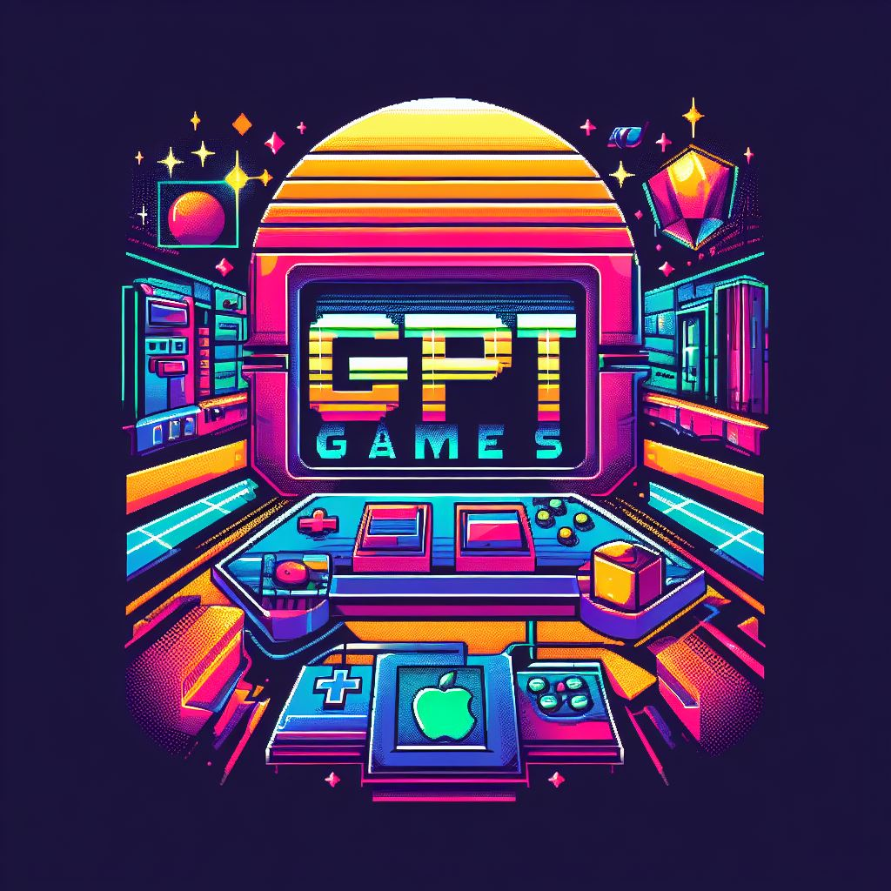

# GPT Games 🎮



Hey there, welcome to **GPT Games**! An open-source gaming paradise crafted with a sprinkle of AI, a dash of creativity, and a whole lot of enthusiasm by [Mark Kuczmarski](https://github.com/kuczmama). If you've ever thought, "what would a game made with the help of an AI look like?" - you're in the right place.

<style>
    .image-container {
        display: flex;
        flex-wrap: wrap;
        width: 100%;
    }

    .image-container img {
        flex: 1;
        max-width: calc(100% / 3);
        min-width: calc(100% / 3);
    }
</style>

<div class="image-container">
    
    
    
</div>

## Games 🕹️

- **Pong Game**: The classic Pong you love, but with a twist – it's made in collaboration with an AI. Bet you didn't see that coming!
- **Mario-inspired Platformer**: Jump, dodge, and collect stars. And remember, every time you fall, somewhere in the cloud, an AI sheds a virtual tear. 🤖

And guess what? More games are on the horizon! Stay tuned for more AI-assisted gaming madness.

## Demo 🚀

Ready to dive in? Check out the live demo [here](https://kuczmama.github.io/gpt-games).

## Contribute 🤝

Got some cool game ideas or tweaks? Let's make GPT Games even better! 

1. **Fork** the repository.
2. **Clone** your forked repo.
   ```bash
   git clone https://github.com/kuczmama/gpt-games.git
   ```
3. Make your magic changes.
4. **Commit** and **push**.
5. Create a new **pull request**.

Not sure how to make a pull request? It's like asking someone out. Scary at first, but totally worth it! 😉 [Here's a guide to help](https://docs.github.com/en/github/collaborating-with-issues-and-pull-requests/creating-a-pull-request).

## License 📜

This project is open source and available under the MIT License.

## Final Words 🎤

Why did the AI go on a date with a computer? Because it heard they had great "bytes". Okay, maybe I should leave the jokes to humans. Enjoy the games!